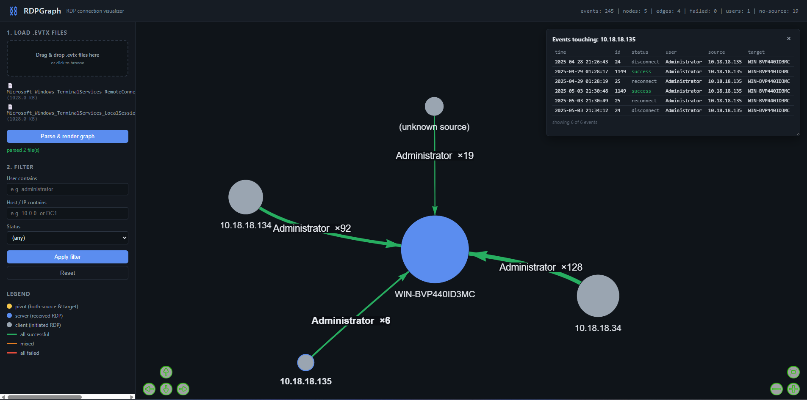

# RDPGraph — RDP Connection Visualizer

A BloodHound-style visualizer for Windows RDP activity. Drop in your `.evtx` files
and see who connected from where as an interactive node-link graph.



> 💡 **For best results, load these two logs together:**
> - `Microsoft_Windows_TerminalServices_LocalSessionManager%4Operational.evtx`
> - `Microsoft_Windows_TerminalServices_RemoteConnectionManager%4Operational.evtx`
>
> These two channels together give the most complete RDP picture — the
> RemoteConnectionManager log provides the **source IP** of incoming connections
> (event 1149), while the LocalSessionManager log provides the **session
> lifecycle** (logon/logoff/reconnect/disconnect). You can add the Security log
> for richer logon-type/failure detail, but these two are the recommended core.
>
> On a Windows host you'll find them under
> `C:\Windows\System32\winevt\Logs\`.

## Supported event sources

| Channel | Event IDs | Meaning |
|---|---|---|
| Security | 4624 (LogonType=10) | Successful RDP logon |
| Security | 4625 (LogonType=10) | Failed RDP logon |
| Security | 4634 / 4647 | Logoff |
| Security | 4778 / 4779 | Session reconnect / disconnect |
| Microsoft-Windows-TerminalServices-LocalSessionManager/Operational | 21, 22, 23, 24, 25 | Session lifecycle |
| Microsoft-Windows-TerminalServices-RemoteConnectionManager/Operational | 1149 | Network-level auth success |

## Quick start

```bash
pip install -r requirements.txt
python app.py
# open http://127.0.0.1:5000
```

Then drag your `.evtx` files onto the page (the two TerminalServices logs noted
above for best results). The graph renders hosts as nodes and RDP sessions as
user-labeled edges (red = failed logon, thickness = frequency).

## How the graph is built

- **Nodes** = unique hosts (source IP/workstation, or target machine that produced the log)
- **Edges** = `source --user--> target`, one edge per (source, target, user) tuple
- **Edge weight** = count of sessions
- **Edge color** = red if any failed logon, green otherwise
- **Node size** = total sessions touching that host

Click a node to see all related events in the side panel. Use the filters to
narrow by user, host, or status.
